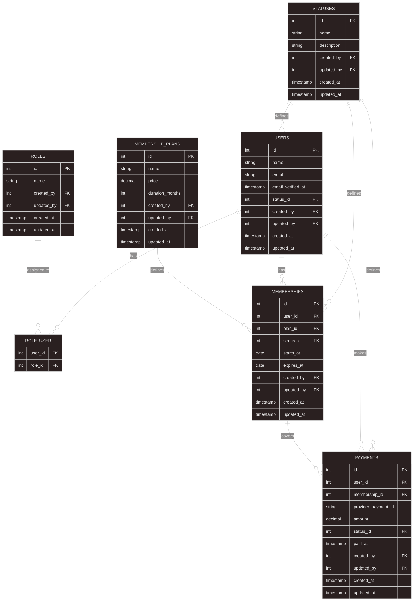

# UTeM : MMSD 5223 - Native Mobile Development II


# 🏋️‍♂️ Gym Membership Backend API (Laravel 10)

This is the Laravel backend API for the **Gym Membership App**, designed to work with a SwiftUI iOS frontend. The system supports Google Sign-In, membership subscriptions, QR code validation, payment via Square, and email notifications.

---

## ✅ Features

- 🔐 Google OAuth login (Socialite) + JWT authentication  
- 📅 Membership plans with subscription durations  
- 📦 QR code generation for membership validation  
- 💳 Square payment integration  
- 🔍 Search feature for users and plans  

---

## 📁 Project Structure

```
```bash
gym-backend/
├── app/
│   ├── Http/
│   │   └── Controllers/
│   │       ├── AuthController.php
│   │       ├── DashboardController.php
│   │       ├── PaymentController.php
│   │       ├── PlanController.php
│   │       └── SubscriptionController.php
│   └── Models/
│       ├── User.php
│       ├── Role.php
│       ├── Status.php
│       ├── Membership.php
│       ├── MembershipPlan.php
│       └── Payment.php
├── routes/
│   ├── api.php
│   └── web.php
├── database/
│   └── migrations/
├── .env
├── composer.json
├── README.md
└── gym\_app.sql
```

---

## ⚙️ Setup Instructions

1. **Clone the repository**

```bash
git clone https://github.com/mizannoor/gym-backend.git
cd gym-backend
````

2. **Install dependencies**

```bash
composer install
```

3. **Environment setup**

```bash
cp .env.example .env
php artisan key:generate
```

> ⚠️ Edit your `.env` file with MySQL and OAuth credentials. Example:

```env
DB_DATABASE=gym_app
DB_USERNAME=root
DB_PASSWORD=your_password

GOOGLE_CLIENT_ID=your_google_client_id
GOOGLE_CLIENT_SECRET=your_google_secret

SQUARE_APPLICATION_ID=your_app_id
SQUARE_ACCESS_TOKEN=your_access_token
```

4. **Run migrations and seeders**

```bash
php artisan migrate --seed
```

5. **Start local development server**

```bash
php artisan serve
```

---

## 🔑 Authentication Flow

* Redirect to: `/api/auth/google/redirect`
* Callback: `/api/auth/google/callback`
* JWT Token will be issued and used like:

```http
Authorization: Bearer YOUR_TOKEN
```

---

## 🔌 API Endpoints (Main)

| Method | Endpoint                    | Purpose                          |
| ------ | --------------------------- | -------------------------------- |
| GET    | `/api/auth/google/redirect` | Begin Google OAuth login         |
| GET    | `/api/memberships`          | Get user membership info         |
| GET    | `/api/membership-plans`     | List available plans             |
| POST   | `/api/subscribe`            | Subscribe to a selected plan     |
| POST   | `/api/payments`             | Initiate Square payment          |
| GET    | `/api/search`               | Search users or membership plans |

---

## 🧪 Testing

You can use Postman or your SwiftUI frontend to test:

* ✅ Gmail login
* ✅ Plan subscription
* ✅ Payment confirmation
* ✅ QR code validation
* ✅ Email delivery on renewal

---

## 🗃️ Entity-Relationship Diagram (ERD)



---

## ✉️ Email Setup

Local testing uses Mailhog:

```env
MAIL_MAILER=smtp
MAIL_HOST=mailhog
MAIL_PORT=1025
```

---

## 📦 Technologies Used

* Laravel 10
* Laravel Socialite (Google Login)
* JWT Authentication (`tymon/jwt-auth`)
* Square API SDK
* QR Code Generator (`bacon/bacon-qr-code`)
* MySQL 8 / MariaDB
* Mailhog or Mailtrap for email testing

---

## 📱 Frontend

Frontend is built using **SwiftUI** and connects via REST API. See [GymMembershipApp iOS App Repository](https://github.com/mizannoor/GymMembershipApp).

---

## 🪪 License

This project is open-source and available under the [MIT license](LICENSE).

```

