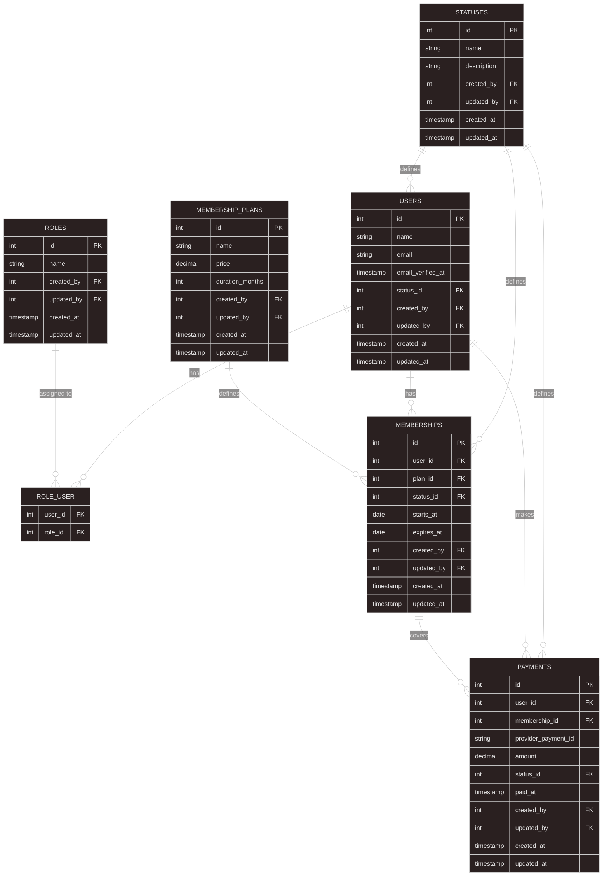

```mermaid
---
config:
  theme: neo-dark
---
erDiagram
    USERS {
        int        id PK
        string     name
        string     email
        timestamp  email_verified_at
        int        status_id FK
        int        created_by FK
        int        updated_by FK
        timestamp  created_at
        timestamp  updated_at
    }
    ROLES {
        int        id PK
        string     name
        int        created_by FK
        int        updated_by FK
        timestamp  created_at
        timestamp  updated_at
    }
    ROLE_USER {
        int        user_id FK
        int        role_id FK
    }
    STATUSES {
        int        id PK
        string     name
        string     description
        int        created_by FK
        int        updated_by FK
        timestamp  created_at
        timestamp  updated_at
    }
    MEMBERSHIP_PLANS {
        int        id PK
        string     name
        decimal    price
        int        duration_months
        int        created_by FK
        int        updated_by FK
        timestamp  created_at
        timestamp  updated_at
    }
    MEMBERSHIPS {
        int        id PK
        int        user_id FK
        int        plan_id FK
        int        status_id FK
        date       starts_at
        date       expires_at
        int        created_by FK
        int        updated_by FK
        timestamp  created_at
        timestamp  updated_at
    }
    PAYMENTS {
        int        id PK
        int        user_id FK
        int        membership_id FK
        string     provider_payment_id
        decimal    amount
        int        status_id FK
        timestamp  paid_at
        int        created_by FK
        int        updated_by FK
        timestamp  created_at
        timestamp  updated_at
    }
    USERS           ||--o{ ROLE_USER         : "has"
    ROLES           ||--o{ ROLE_USER         : "assigned to"
    STATUSES        ||--o{ USERS             : "defines"
    STATUSES        ||--o{ MEMBERSHIPS       : "defines"
    STATUSES        ||--o{ PAYMENTS          : "defines"
    USERS           ||--o{ MEMBERSHIPS       : "has"
    MEMBERSHIP_PLANS||--o{ MEMBERSHIPS       : "defines"
    USERS           ||--o{ PAYMENTS          : "makes"
    MEMBERSHIPS     ||--o{ PAYMENTS          : "covers"

```